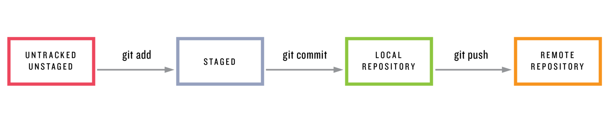

# Git Introduction


---
@transition[fade-in fade-out]

## VCS or Versioning

In a nutshell, versioning is a technique for mananing large/small projects by __track and documenting changes__, __troubleshooting__, and __adding features__.

+++
@transition[zoom-in zoom-out]

### What is Git?

A Version Control System (VCS) provides an automatic way to track changes in software projects.

+++
@transition[zoom-in zoom-out]

### Download Git-Bash

- [Git for Windows](https://git-scm.com/download/win)
- [Git for Mac](https://git-scm.com/download/mac)
- [Git for Linux](https://git-scm.com/download/linux)

+++
@transition[zoom-in zoom-out]

### Benefit of Git

@ul

- Giving creator to view previous versions of files and directories
- Develop speculative features without disrupting the main development
- Securely backup the project and its history
- Collaborate easily and conveniently with others

@ulend

---
@transition[fade-in fade-out]

## What is GitHub

GitHub is a service that allows you to host Git Repositories online, accessible, and to collaborate with others on them.

---
@transition[fade-in fade-out]

## How Git Works

+++?image=template/images/git-flow.png
@transition[zoom-in zoom-out]

---
@transition[fade-in fade-out]

## Get wet with Git

+++
@transition[zoom-in zoom-out]

@snap[north-west]
<h3>Terminal Commands</h3>
@snapend

```bash
pwd
ls
cd [directory-name]
mkdir [directory-name]
```

@[1](__p__rint __w__orking __d__irectory)
@[2](__list__ files in the current directory)
@[3](__c__hanges/moves to the given __d__irectory name/path)
@[4](__m__akes new __d__irectory)

+++
@transition[zoom-in zoom-out]

### Illustration


+++
@transition[zoom-in zoom-out]

### Demo Project

@ol

- Create project directory
- Initiate `git` repository
- Code → Save → Staged → Commit
- Edit → Save → Staged → Commit

@olend

---
@transition[fade-in fade-out]

## Create Project Directory

```bash
mkdir ProjectName
cd ProjectName
```

@[1](Create project directory)
@[2](Change directory to it)

---
@transition[fade-in fade-out]

## Initate `git` repo

```bash
git init
git status
```

@[1](Initiate git repo)
@[2](state info of your repo)

+++
@transition[zoom-in zoom-out]

### Git Clone

```bash
git clone https://github.com/sk-datascience/demo-project.git
git clone https://github.com/sk-datascience/demo-project.git [new-directory-name]
```

@[1](clone repo from github/bitbucket/gitlab)
@[2](clone repo and give new directory name - optional)

+++
@transition[zoom-in zoom-out]

### Summary - git init

- `git init` create a new, empty repository in the current directory
- It creates hidden `.git` directory, the brain/storage center for the repo
- Holds all configuration files and all of the __commits__

+++
@transition[zoom-in zoom-out]

### Summary - git clone

- Create identical copy of existing repo
- Create new directory with the same name as the cloned repo (by default)
- Ease of collaboration

---
@transition[fade-in fade-out]

## Repo's Status

The purpose is to tell us what Git is thinking and the state of our repo as Git
sees it.

+++
@transition[zoom-in zoom-out]

### git status

```bash
$ git status
On branch master

No commits yet

nothing to commit (create/copy files and use "git add" to track)
```

@[1](check status)
@[2-5](repo's initial status)

+++
@transition[zoom-in zoom-out]

### Summary - git status

- Display current status of the repository
- Will be used __all the time__
- Tell us about new files that haven't been tracked by git, yet
- Files git __is__ tracking that have been modified
- Others

---
@transition[fade-in fade-out]

## Code with your language

- Create a file with particular format
- Code! Save it!

+++
@transition[zoom-in zoom-out]

### Example `hello.py`

```python
name = "Sains Komputasi"
print("Hello, ", name)
```

---
@transition[fade-in fade-out]

## How Git Works



---
@transition[fade-in fade-out]

## Git Add

@ul

- For Git to track a file, it needs to be committed to the repo
- Before commit file(s), they need to be __staged__
- `git add` will move files from _working directory_ to _staging index/area_

@ulend

+++?image=template/gif/staging.gif

Note:

Yang sudah dilakukan:

- Buat direktori dan repo
- Code and save!
- staging sama saja dengan fase persiapan sebelum state file disimpan
- memindahkan files ke staging area/index dengan git add

+++
@transition[zoom-in zoom-out]

### Summary - git add

- `$ git add <file1> <file2> … <fileN>`
- `git add` is used to move files from Working Directory to Staging Index
- Alternative usage to stage all files using `git add .`
- Don't forget to use `git status` to check repo's status

---
@transition[fade-in fade-out]

## Git Commit

@quote[First, before committing, config your code editor in git. This is confusing!!]

+++
@transition[zoom-in zoom-out]

### Committing

```bash
git commit -m "commit message"
```

Note:

Alternatif lain yang memudahkan jika editor sulit untuk diintegrasikan dengan
git, `-m` mengizinkan kita untuk menuliskan pesan commit secara langsung tanpa
membuka editor

+++
@transition[zoom-in zoom-out]

### What to Include in A Commit

Each commit has a single focus: __Record a "single-unit" change__

@ul

- A little bit subjective
- But, it should make a change to just __one aspect of the project__
- Conversely, a commit shouldn't include unrelated changes

@ulend

+++
@transition[zoom-in zoom-out]

@snap[north-west]
<h3 >A Commit Message should..</h3>
@snapend

@ul

- keep the message short (less than 60-ish characters)
- explain __what__ the commit does (no __how__ or __why__!)

@ulend

+++
@transition[zoom-in zoom-out]

@snap[north-west]
<h3 >A Commit Message should not..</h3>
@snapend

@ul

- explain __why__ changes are made
- explain __how__ changes are made
- use the word __and__

@ulend

Note:

- how changes are made is what `git log -p` for
- word and means probably the commit can be broken into several commit

+++
@transition[zoom-in zoom-out]

### Summary - Git Commit

- takes files from staging index and save them into git repo
- You can use `-m` to include commit message directly (if you know what you're doing)
- Keep commit message short but still easy to understand  
- __Be consistent__ in how we write commit message

Note:

- Short mention `git diff`

---
@transition[fade-in fade-out]

## Review Repo's History

---
@transition[fade-in fade-out]

## Undoing Changes

---
@transition[fade-in fade-out]

## Tagging, Branching, Merging

---
@transition[fade-in fade-out]

## GitHub

---?image=template/images/how-github-works.png
@transition[fade-in fade-out]

---
@transition[fade-in fade-out]

## Demo GitHub

1. Create GitHub Account
2. Fork, Git Clone, Git Pull, Git Push
3. GitHub Showcase

[Education GitHub](https://education.github.com)

---
@transition[fade-in fade-out]

## Thank You
